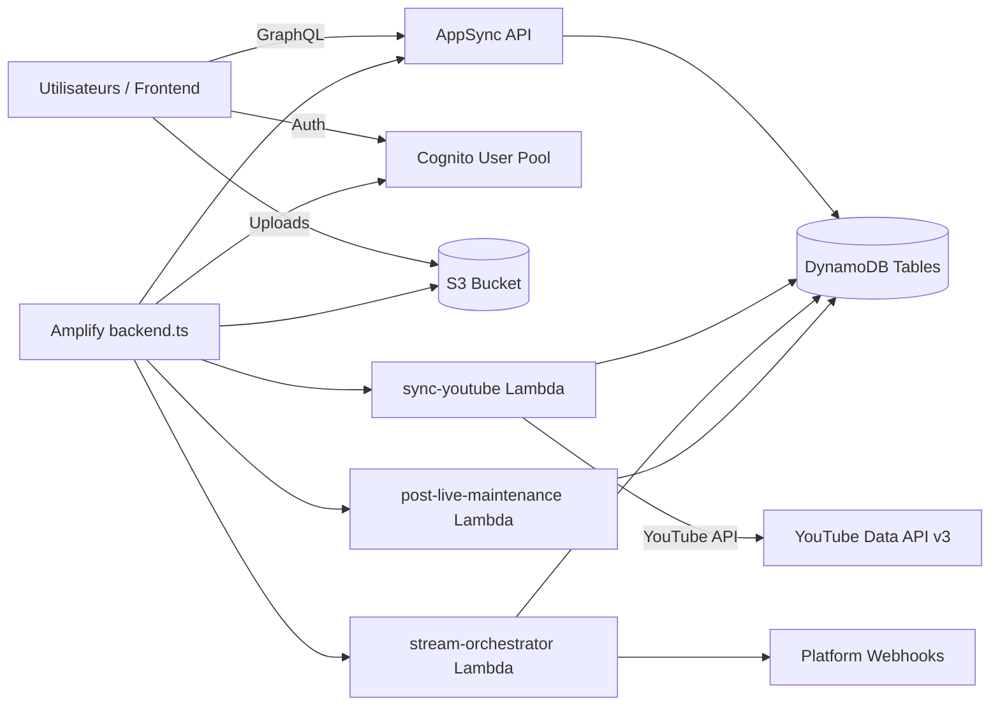
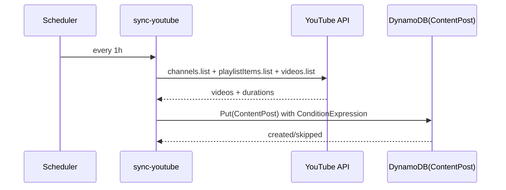
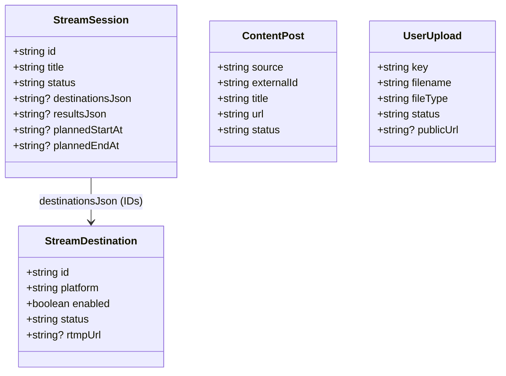
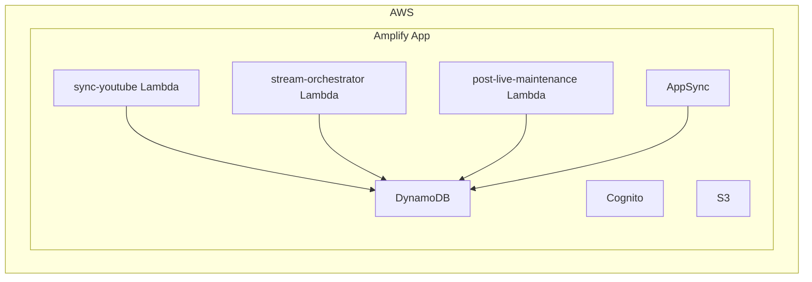
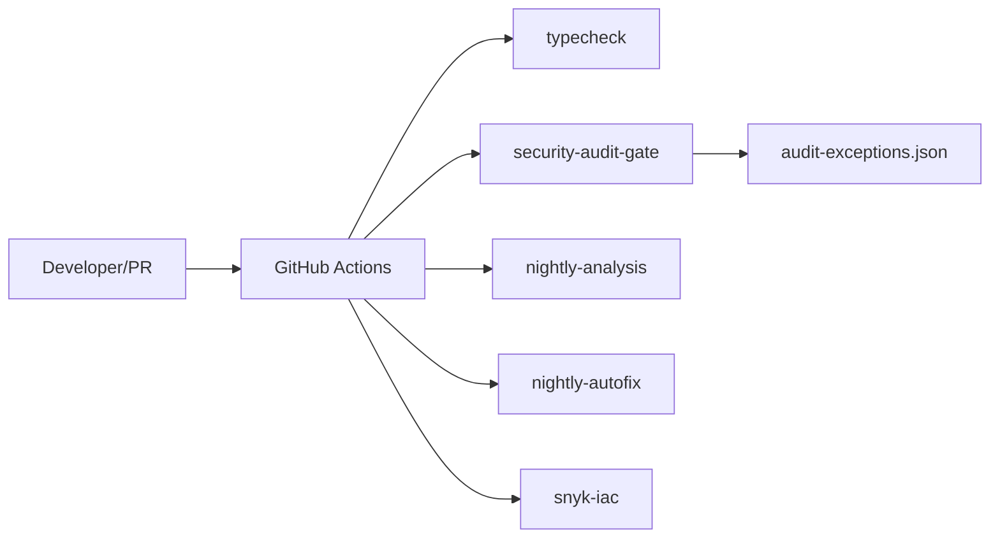

# Onboarding Technique — davidkrk-automation-backend

## 1. README / Fichiers d’instructions — Synthèse

### Fichiers trouvés
- [README.md](./README.md)
- [CONTRIBUTING.md](./CONTRIBUTING.md)
- [SECURITY.md](./SECURITY.md)
- [CODE_OF_CONDUCT.md](./CODE_OF_CONDUCT.md)

### Ce qu’un nouveau développeur doit retenir
- **Vue d’ensemble produit** : backend AWS Amplify Gen 2 pour automatiser la chaîne DavidKRK (sync YouTube, gestion des streams multi-plateformes, uploads utilisateurs, API publique) ([README.md](./README.md)).
- **Mise en route locale** : `npm install`, `npm run typecheck`, puis déploiement avec `npx ampx pipeline-deploy ...` ([README.md](./README.md)).
- **Conventions de contribution** : PR ciblées, partir de `main`, passer les vérifications locales, soigner les messages de commit ([CONTRIBUTING.md](./CONTRIBUTING.md)).
- **Sécurité** : signalement des vulnérabilités via canal AWS dédié (pas d’issue publique), branche `main` comme branche supportée, audit gate CI avec exceptions temporaires pilotées ([SECURITY.md](./SECURITY.md)).
- **Conduite** : adoption de l’Amazon Open Source Code of Conduct ([CODE_OF_CONDUCT.md](./CODE_OF_CONDUCT.md)).

---

## 2. Stack technologique détaillée

### Langages et versions
- **TypeScript** (strict) : [amplify/tsconfig.json](./amplify/tsconfig.json)
- **Node.js 26** : [.nvmrc](./.nvmrc), [amplify.yml](./amplify.yml)
- **JavaScript (Node mjs)** pour scripts CI : [.github/scripts](./.github/scripts)

### Frameworks / SDKs backend
- **AWS Amplify Gen 2** : `@aws-amplify/backend`, `@aws-amplify/backend-*` ([package.json](./package.json))
- **AWS CDK (v2)** indirectement via Amplify : `aws-cdk`, `aws-cdk-lib`, `constructs` ([package.json](./package.json))
- **AWS SDK v3 DynamoDB** : `@aws-sdk/client-dynamodb`, `@aws-sdk/lib-dynamodb` ([package.json](./package.json))
- **AWS Lambda types** : `@types/aws-lambda` ([package.json](./package.json))

### Données / persistance
- **DynamoDB (NoSQL)** via Amplify Data + AppSync GraphQL : [amplify/data/resource.ts](./amplify/data/resource.ts)
- **S3** pour stockage de fichiers utilisateurs : [amplify/storage/resource.ts](./amplify/storage/resource.ts)

### Authentification / autorisation
- **Cognito User Pool** (login email) : [amplify/auth/resource.ts](./amplify/auth/resource.ts)
- Autorisation mixte **API Key**, **owner**, **groups(admin)** sur modèles GraphQL : [amplify/data/resource.ts](./amplify/data/resource.ts)

### Style d’architecture
- **Backend serverless monorepo** (Amplify Gen 2): ressources déclaratives + Lambdas planifiées + AppSync GraphQL.
- Fichier d’assemblage principal : [amplify/backend.ts](./amplify/backend.ts)

### Cloud / build / package manager
- **Cloud principal** : AWS (Amplify, Lambda, AppSync, DynamoDB, Cognito, S3)
- **Package manager** : npm (lockfile versionné) ([package-lock.json](./package-lock.json))
- **Build/deploy CI** : Amplify buildspec + GitHub Actions ([amplify.yml](./amplify.yml), [.github/workflows](./.github/workflows))

### Autres technologies
- **Snyk IaC scan** (optionnel si token présent) : [.github/workflows/snyk-infrastructure.yml](./.github/workflows/snyk-infrastructure.yml)
- **Dependabot** npm hebdo : [.github/dependabot.yml](./.github/dependabot.yml)
- **Overrides npm sécurité** (ex: `csv-parse`) : [package.json](./package.json)

---

## 3. Vue d’ensemble système et finalité

### À quoi sert le système
Ce backend centralise l’automatisation opérationnelle autour d’une activité de contenu/livestream :
- ingestion de contenu YouTube en posts structurés,
- orchestration de sessions de stream vers plusieurs plateformes,
- archivage post-live,
- stockage/upload de fichiers utilisateurs,
- exposition des données via API GraphQL publique/privée selon modèles.

### Public cible
- Équipe technique qui opère l’automatisation de la chaîne DavidKRK.
- Frontend(s) consommateurs de l’API AppSync (lecture publique de contenu, lecture ciblée d’uploads, administration via auth).

### Fonctionnalités cœur
- Synchronisation horaire YouTube -> `ContentPost` (idempotente) ([sync-youtube/handler.ts](./amplify/functions/sync-youtube/handler.ts)).
- Orchestration de `StreamSession` (`pending` -> `ended`/`failed`) ([stream-orchestrator/handler.ts](./amplify/functions/stream-orchestrator/handler.ts)).
- Maintenance post-live avec création d’archive `ContentPost` source `livestream` ([post-live-maintenance/handler.ts](./amplify/functions/post-live-maintenance/handler.ts)).
- Gestion d’uploads S3 avec règles d’accès fines ([storage/resource.ts](./amplify/storage/resource.ts)).

---

## 4. Structure du projet et recommandations de lecture

### 4.1 Entry points principaux
- Backend composition: [amplify/backend.ts](./amplify/backend.ts)
- Définition du schéma data/autorisation: [amplify/data/resource.ts](./amplify/data/resource.ts)
- Lambdas métier:
  - [amplify/functions/sync-youtube/handler.ts](./amplify/functions/sync-youtube/handler.ts)
  - [amplify/functions/stream-orchestrator/handler.ts](./amplify/functions/stream-orchestrator/handler.ts)
  - [amplify/functions/post-live-maintenance/handler.ts](./amplify/functions/post-live-maintenance/handler.ts)

### 4.2 Organisation générale
- `amplify/`
  - `backend.ts`: wiring inter-ressources (permissions/env vars)
  - `auth/resource.ts`: Cognito
  - `data/resource.ts`: modèles AppSync/DynamoDB
  - `storage/resource.ts`: règles S3
  - `functions/*`: Lambdas planifiées + connecteurs
- `.github/workflows/`: pipelines d’analyse, audit sécurité, autofix, scan IaC
- `.github/scripts/`: logique custom de policy/audit/report
- racine: `README.md`, `CONTRIBUTING.md`, `SECURITY.md`, `package.json`, `amplify.yml`

### 4.3 Configurations critiques
- Runtime Node: [.nvmrc](./.nvmrc)
- Build/deploy Amplify: [amplify.yml](./amplify.yml)
- Dépendances/scripts: [package.json](./package.json)
- TypeScript strict et alias générés Amplify: [amplify/tsconfig.json](./amplify/tsconfig.json)
- Exceptions sécurité CI: [.github/security/audit-exceptions.json](./.github/security/audit-exceptions.json)

### 4.4 Ordre de lecture conseillé
1. [README.md](./README.md)
2. [amplify/backend.ts](./amplify/backend.ts)
3. [amplify/data/resource.ts](./amplify/data/resource.ts)
4. [amplify/functions/stream-orchestrator/handler.ts](./amplify/functions/stream-orchestrator/handler.ts)
5. [amplify/functions/sync-youtube/handler.ts](./amplify/functions/sync-youtube/handler.ts)
6. [amplify/functions/post-live-maintenance/handler.ts](./amplify/functions/post-live-maintenance/handler.ts)
7. [amplify/storage/resource.ts](./amplify/storage/resource.ts)
8. [.github/workflows/security-audit-gate.yml](./.github/workflows/security-audit-gate.yml)

---

## 5. Composants clés

### 5.1 Composition du backend Amplify
- **Implémentation** : [amplify/backend.ts](./amplify/backend.ts)
- **Responsabilité** : instancier les ressources, vérifier leur présence, accorder les permissions DynamoDB, injecter les env vars de tables.

```ts
const backend = defineBackend({
  auth,
  data,
  storage,
  syncYoutube,
  streamOrchestrator,
  postLiveMaintenance,
});

contentPostTable.grantReadWriteData(lambdaFunction);
streamSessionTable.grantReadWriteData(streamOrchestratorFunction);
backend.streamOrchestrator.addEnvironment("STREAM_SESSION_TABLE_NAME", streamSessionTable.tableName);
```

### 5.2 Modèle de données GraphQL/DynamoDB
- **Implémentation** : [amplify/data/resource.ts](./amplify/data/resource.ts)
- **Responsabilité** : définir entités métier (`StreamDestination`, `StreamSession`, `UserUpload`, `ContentPost`), indexes et règles d’autorisation.

```ts
ContentPost: a
  .model({
    source: a.string().required(),
    externalId: a.string().required(),
    title: a.string().required(),
    url: a.string().required(),
    publishedAt: a.string().required(),
    status: a.string().required(),
  })
  .identifier(["source", "externalId"])
  .authorization((allow) => [allow.publicApiKey().to(["read"])]),
```

### 5.3 Lambda `sync-youtube`
- **Implémentation** :
  - ressource: [amplify/functions/sync-youtube/resource.ts](./amplify/functions/sync-youtube/resource.ts)
  - logique: [amplify/functions/sync-youtube/handler.ts](./amplify/functions/sync-youtube/handler.ts)
- **Responsabilité** : lire playlist uploads YouTube, détecter les shorts, écrire en idempotent dans `ContentPost`.

```ts
await dynamo.send(
  new PutCommand({
    TableName: TABLE_NAME,
    Item: post,
    ConditionExpression: "attribute_not_exists(source)",
  })
);
```

### 5.4 Lambda `stream-orchestrator`
- **Implémentation** :
  - ressource: [amplify/functions/stream-orchestrator/resource.ts](./amplify/functions/stream-orchestrator/resource.ts)
  - logique: [amplify/functions/stream-orchestrator/handler.ts](./amplify/functions/stream-orchestrator/handler.ts)
- **Responsabilité** : piloter les transitions de sessions en appelant des connecteurs par plateforme.

```ts
if (session.status === "pending") {
  const { results: phaseResults, failures } = await runPhase("prepareLive", session, selectedDestinations);
  await updateSession(sessionTableName, session.id, failures.length > 0 ? "failed" : "starting", mergedResults, session.status, failures[0]);
}
```

### 5.5 Connecteurs plateformes
- **Implémentation** : [amplify/functions/stream-orchestrator/connectors](./amplify/functions/stream-orchestrator/connectors)
- **Responsabilité** : abstraction par plateforme (YouTube/Twitch/Facebook) avec fallback de simulation.

```ts
if (!endpoint) {
  if (process.env.ALLOW_SIMULATED_CONNECTORS === "true") {
    return { success: true, message: fallbackMessage };
  }
  return { success: false, message: "Missing connector webhook URL..." };
}
```

### 5.6 Lambda `post-live-maintenance`
- **Implémentation** :
  - ressource: [amplify/functions/post-live-maintenance/resource.ts](./amplify/functions/post-live-maintenance/resource.ts)
  - logique: [amplify/functions/post-live-maintenance/handler.ts](./amplify/functions/post-live-maintenance/handler.ts)
- **Responsabilité** : transformer les sessions `ended` non traitées en archives `ContentPost` puis marquer `postLiveProcessedAt`.

```ts
await dynamo.send(new QueryCommand({
  TableName: tableName,
  IndexName: STREAM_SESSION_STATUS_INDEX,
  KeyConditionExpression: "#status = :ended",
  FilterExpression: "attribute_not_exists(postLiveProcessedAt)",
}));
```

---

## 6. Flux d’exécution et flux de données

### 6.1 Flux critique A — Sync YouTube
1. Lambda schedule `every 1h` déclenche `sync-youtube`.
2. Appels YouTube API (`channels.list`, `playlistItems.list`, `videos.list`).
3. Mapping en `ContentPost`.
4. `PutCommand` idempotent dans DynamoDB.
5. Logging de synthèse (`created/skipped`).

### 6.2 Flux critique B — Orchestration livestream
1. Lambda `stream-orchestrator` (`every 5m`) charge sessions actives (`pending|starting|live|ending`).
2. Charge destinations `active|error` et filtre `enabled`.
3. Valide `destinationsJson`, timestamps planifiés.
4. Exécute phase connecteur (`prepareLive`, `startLive`, `stopLive`).
5. Met à jour `StreamSession` conditionnellement (optimistic concurrency).

### 6.3 Flux critique C — Maintenance post-live
1. Lambda `post-live-maintenance` (`every 1h`) lit sessions `ended` sans `postLiveProcessedAt`.
2. Crée `ContentPost` source `livestream` de manière idempotente.
3. Marque la session traitée (`postLiveProcessedAt`).

### 6.4 Persistance / propagation
- **Écriture principale** : DynamoDB tables générées par Amplify Data (`StreamSession`, `StreamDestination`, `ContentPost`, `UserUpload`).
- **Stockage fichiers** : S3 (`uploads/{entity_id}` et `public/{entity_id}`).
- **Lecture API** : AppSync GraphQL avec auth mode mixte.

### 6.5 Vue schéma base de données (6.1)
Entités principales et relations logiques:
- `StreamDestination` : destinations stream configurées.
- `StreamSession` : session pilotée; référence logique vers destinations via `destinationsJson` (liste d’IDs JSON).
- `ContentPost` : contenu publié (source `youtube` ou `livestream`), clé composite `(source, externalId)`.
- `UserUpload` : métadonnées des fichiers utilisateurs (objet réel en S3).

---

## 7. Dépendances et intégrations

### 7.1 Dépendances clés
- **Amplify backend/data/auth/function/storage**: définition d’infra et API ([package.json](./package.json)).
- **AWS SDK DynamoDB v3**: accès runtime depuis Lambdas ([package.json](./package.json)).
- **TypeScript + tsx + esbuild**: compilation/exécution outillage ([package.json](./package.json)).

### 7.2 Intégrations externes
- **YouTube Data API v3** : sync vidéos + metadata shorts ([sync-youtube/handler.ts](./amplify/functions/sync-youtube/handler.ts)).
- **Webhooks plateforme live** : endpoints YouTube/Twitch/Facebook pilotés via POST JSON ([connectors/http.ts](./amplify/functions/stream-orchestrator/connectors/http.ts)).
- **AWS services** : Cognito, AppSync, DynamoDB, S3, Lambda (via ressources Amplify).

### 7.3 API Documentation (7.1)
- Pas de Swagger/OpenAPI REST détecté.
- L’API exposée est **GraphQL AppSync** via schéma Amplify ([amplify/data/resource.ts](./amplify/data/resource.ts)).
- La “documentation API” principale est donc le schéma de modèles et autorisations dans ce fichier.

---

## 8. Diagrammes (Mermaid)

### 8.1 Diagramme composants



### 8.2 Diagramme flux de données



### 8.3 Diagramme de classes simplifié



### 8.4 Diagramme de déploiement simplifié



### 8.5 Diagramme infra / sécurité CI simplifié



---

## 9. Tests

### Ce qui existe
- **Type checking TypeScript** (principal contrôle qualité) : `npm run typecheck` ([package.json](./package.json)).
- **Script `test` présent mais non implémenté** (`exit 1`) : [package.json](./package.json).

### Pipelines CI liés
- Analyse nocturne lance `npm run typecheck`, `npm audit`, `npm outdated` ([.github/workflows/nightly-analysis.yml](./.github/workflows/nightly-analysis.yml)).
- Autofix lance `npm run typecheck --if-present` puis `npm test --if-present` ([.github/workflows/nightly-autofix-from-report.yml](./.github/workflows/nightly-autofix-from-report.yml)).

### Exécution locale recommandée
```bash
npm install
npm run typecheck
npm audit
```

> Il n’y a pas de suite unitaire/intégration/e2e explicite versionnée à ce stade.

---

## 10. Gestion d’erreurs et logs

### Patterns d’erreur
- Validation explicite des variables d’environnement via `getRequiredEnv` (throw rapide) dans les handlers.
- Gestion d’erreurs idempotentes DynamoDB (`ConditionalCheckFailedException`) pour éviter les doublons.
- Orchestrateur: erreurs de payload/timestamps mènent à `status=failed` avec `lastError` dans `StreamSession`.

### Logging
- Logging standard `console.info`, `console.warn`, `console.error` dans Lambdas.
- Pas de librairie de logging dédiée (pino/winston) détectée.
- Pas de format structuré JSON strict imposé globalement.

### Monitoring observé
- Monitoring sécurité/qualité via GitHub Actions (audit gate, nightly analysis, Snyk IaC).
- Pas d’intégration explicite Datadog/Sentry détectée dans ce dépôt.

---

## 11. Sécurité

### Mécanismes visibles
- **Authentification**: Cognito email login ([amplify/auth/resource.ts](./amplify/auth/resource.ts)).
- **Autorisation**:
  - `groups(["admin"])` pour `StreamDestination` / `StreamSession`
  - `owner()` + `publicApiKey().to(["read"])` pour `UserUpload`
  - `publicApiKey().to(["read"])` pour `ContentPost`
  ([amplify/data/resource.ts](./amplify/data/resource.ts)).
- **Secrets**:
  - `secret("YOUTUBE_API_KEY")`, `secret("YOUTUBE_CHANNEL_ID")` dans ressource lambda ([sync-youtube/resource.ts](./amplify/functions/sync-youtube/resource.ts)).
- **Hardening CI**:
  - audit gate bloquant pour vulnérabilités directes high/critical + exceptions datées ([security-audit-gate.yml](./.github/workflows/security-audit-gate.yml), [audit-exceptions.json](./.github/security/audit-exceptions.json)).
  - script de garde contre patterns glob alimentés par entrée non fiable ([no-untrusted-glob-patterns.mjs](./.github/scripts/no-untrusted-glob-patterns.mjs)).

### Bonnes pratiques notables
- Idempotence systématique côté écritures critiques (sync et archivage).
- Exceptions sécurité temporairement encadrées (owner/issue/expiry requis).
- Documentation explicite “ne jamais committer de secrets”.

---

## 12. Autres observations pertinentes (build/deploy inclus)

### Build & déploiement
- [amplify.yml](./amplify.yml)
  - installe Node 26,
  - exécute `npm ci --cache .npm --prefer-offline`,
  - déploie avec `npx ampx pipeline-deploy`.
- Frontend “placeholder” (`dist/index.html`) pour satisfaire le pipeline Amplify, mais ce dépôt est backend-centric.

### CI/CD / maintenance
- **Analyse nocturne** avec issue auto mise à jour ([nightly-analysis.yml](./.github/workflows/nightly-analysis.yml), [nightly-analysis-report.mjs](./.github/scripts/nightly-analysis-report.mjs)).
- **Autofix dépendances** gouverné par allowlist et garde-fous de major versions (`typescript <=5`, `@types/node <=26`) ([nightly-autofix-from-report.yml](./.github/workflows/nightly-autofix-from-report.yml)).
- **Security gate** + **upstream monitor** hebdo des exceptions ([security-audit-gate.yml](./.github/workflows/security-audit-gate.yml), [security-upstream-monitor.mjs](./.github/scripts/security-upstream-monitor.mjs)).

### Points d’attention pour onboard rapide
- Le cœur métier est dans `stream-orchestrator` + modèles `StreamSession/StreamDestination`.
- Les intégrations plateformes live sont découplées via connecteurs webhooks; le mode simulation peut masquer des écarts prod si activé.
- Le modèle `StreamSession.destinationsJson` encode des IDs en JSON string (pas relation forte de schéma), donc vigilance sur validation/consistance.
- `npm test` n’est pas une vraie suite de test pour le moment; la confiance repose surtout sur typecheck + audit + revues.

---

## Annexes — Liens techniques rapides
- Composition backend: [amplify/backend.ts](./amplify/backend.ts)
- Schéma data: [amplify/data/resource.ts](./amplify/data/resource.ts)
- Auth: [amplify/auth/resource.ts](./amplify/auth/resource.ts)
- Storage: [amplify/storage/resource.ts](./amplify/storage/resource.ts)
- Sync YouTube: [amplify/functions/sync-youtube/handler.ts](./amplify/functions/sync-youtube/handler.ts)
- Orchestrateur stream: [amplify/functions/stream-orchestrator/handler.ts](./amplify/functions/stream-orchestrator/handler.ts)
- Connecteurs: [amplify/functions/stream-orchestrator/connectors/index.ts](./amplify/functions/stream-orchestrator/connectors/index.ts)
- Post-live: [amplify/functions/post-live-maintenance/handler.ts](./amplify/functions/post-live-maintenance/handler.ts)
- Buildspec Amplify: [amplify.yml](./amplify.yml)
- Workflows CI: [.github/workflows](./.github/workflows)
- Scripts sécurité CI: [.github/scripts/security-audit-gate.mjs](./.github/scripts/security-audit-gate.mjs), [.github/scripts/security-upstream-monitor.mjs](./.github/scripts/security-upstream-monitor.mjs)
